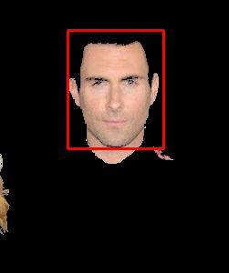

# 5293_hw1
### Work Flow
1. Read image data and
2. Turn rgb color information to L*a*b* color space in one-dimensional array. For the  L*a*b* color space, L* represents luminance, a*  represents the color opponent green–red and b*  represents the color opponent blue–yellow.
2. Use k-means algorithm to classify color to different category.
3. Separate different category color, turn into True/False matrix for next step.
4. Check coverage from top left to right bottom, if coverage in scope, then set position as target area.

### Variables explain
| variables | meaning |
| --- | --- |
| n_clusters | how many color categories |
| source_file_name | source image file name|
| img_data | lab color info in one-dimensional array |
| result | data after k-means calculate | 
| imgs | different category color matrix | 
|current_rate | cover percent | 

### Function explain

##### rgb2lab
This function turn rgb tuples to lab tuples, reference https://stackoverflow.com/questions/13405956/convert-an-image-rgb-lab-with-python.
    
##### read_img
This function read image data, use rgb2lab to get lab info of every pixel, and return array, and row number and col number of image pixel matrix.

##### check_face
This function check a box area row by row and col by col, when find a area coverage in target scope, then mark as face area.

##### generate_result
This function draw the separate category pixel of source image, and draw a rectangle border for the face.

### Result
Multi face detecting is not implemented now.

.

### Limitations
It can be noticed that some hair and three fingers show up in the output, because these hair and fingers have similar color with skin. And further regularization processing must be applied to filter removing these noises. Also, my script currently can only detect one face by the area coverage check, because the way checking face is simple, just check percentage. I think k-means can only help separating image parts (and I need to adjust n manually for better effect), but human face detecting is particular domain, we may need face model to help improving the result. 
